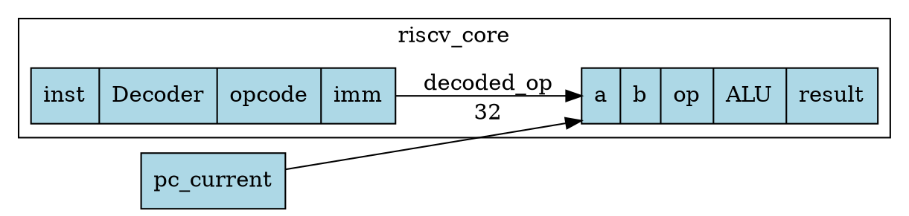

# OpenCode 工作流：Verilog/SystemVerilog ↔ JSON 双向转换与 Block Design 可视化

**版本**：1.0.0  
**目标**：建立一套标准化流水线，将任意 Verilog/SystemVerilog 代码无损转换为符合双向规范的 JSON，同时自动渲染为芯片设计风格的模块连接图（Block Design），并支持工程师交互式修改后反向生成代码。

---

## 1. 总体架构设计

本工作流采用 **“解析层（Parser）→ 规范化中间层（AST-JSON）→ 表现层（Visualizer）”** 的三层解耦架构。

- **输入层**：Verilog / SystemVerilog 源文件（支持 `include` 和宏定义）。
- **中间层（核心）**：严格遵循 `VERILOG_JSON_BIDIRECTIONAL_SPEC_v1.0` 的 JSON 文件（这是唯一的真源，所有修改在此进行）。
- **输出层**：反向生成的 Verilog 代码 + 基于 Graphviz / HTML Canvas 的 Block Design 可视化图。

```text
[*.v / *.sv]  
     │
     ▼ (Parse & Extract)
+----------------------------------------+
|  转译引擎 (Verilog → 规范 JSON)         |  <- 核心解析脚本
+----------------------------------------+
     │
     ▼
[design_spec.json]  (人类可读，支持 Git 版本控制)
     │
     ├─────────────┬─────────────┐
     ▼             ▼             ▼
+----------+ +----------+ +------------------+
| 反向生成  | | 可视化    | | 交互式修改      |
| (JSON→.v) | | (SVG/PNG) | | (编辑 JSON 文件) |
+----------+ +----------+ +------------------+
```

---

## 2. 环境准备与依赖

建议使用 Python 3.10+ 作为胶水语言，配合以下开源工具：

| 组件 | 工具/库 | 用途 |
| :--- | :--- | :--- |
| Verilog 解析器 | **slang** (推荐) 或 **pyverilog** | 将 HDL 代码解析为 AST。`slang` 对 SystemVerilog 支持更好。 |
| JSON 序列化 | Python `json` 标准库 | 读写规范 JSON。 |
| 可视化渲染 | **Graphviz** (`pygraphviz` / `graphviz` Python 包) | 生成 Block Design 风格的模块连接图。 |
| 反向代码生成 | Python 字符串模板 | 根据 JSON AST 递归拼接 Verilog 代码。 |
| 交互式环境 | VS Code + 自定义插件（可选） | 便于 JSON 树浏览与修改。 |

**安装命令示例（Ubuntu）**：
```bash
# 安装 Graphviz 系统依赖
sudo apt-get install graphviz libgraphviz-dev

# 安装 Python 依赖
pip install slang-py graphviz jsonref
```

---

## 3. 阶段一：Verilog → 规范 JSON（前向转换）

本阶段负责将 RTL 源码转化为符合规范的 JSON。转换脚本的核心逻辑是 **AST 节点映射**。

### 3.1 解析入口
编写脚本 `parse_to_json.py`，针对输入的顶层模块名执行解析：
```bash
python parse_to_json.py --top riscv_core --incdir ./include ./rtl/*.v -o design.json
```

### 3.2 核心映射规则（示例）
| Verilog 节点 | 规范 JSON 对应字段 | 处理逻辑 |
| :--- | :--- | :--- |
| `module_decl` | `modules[0]` | 提取名称、参数列表 |
| `input/output` 声明 | `ports[]` | 提取方向、位宽、数据类型（wire/reg） |
| `always_ff @(posedge clk)` | `always_blocks[].sensitivity` | 识别边沿关键字并结构化存储 |
| 阻塞/非阻塞赋值 (`=`/`<=`) | `assignment.blocking` | 提取 LHS 和 RHS 的 AST |
| 表达式 `a + b` | `{op:"+", left:{ref:"a"}, right:{ref:"b"}}` | **必须递归解析为 AST 对象，禁止存字符串** |

### 3.3 关键注意事项
- **宏展开**：解析器需预先处理 `` `define ``，或保留宏名并在 JSON 的 `defines` 字段中定义，以便反向还原。
- **数值保留**：所有 `literal` 必须包含完整位宽和进制（如 `"32'hDEAD"`）。
- **覆盖率**：当前版本需支持 `always_comb`、`always_ff`、`assign`、`if-else`、`case`、`实例化`、`function/task`、`generate`。

---

## 4. 阶段二：规范 JSON → Verilog（反向转换）

为确保双向完备性，反向生成器必须严格遍历 JSON 的 AST 节点，并遵循 Verilog 语法生成代码字符串。

### 4.1 生成策略
编写脚本 `generate_from_json.py`：
```bash
python generate_from_json.py design.json -o generated_riscv_core.v
```

### 4.2 代码拼接流程
1.  **头部生成**：输出 `` `include `` 和 `` `define ``。
2.  **模块头**：生成 `module name #(params) (ports);`（采用 ANSI 风格）。
3.  **声明区**：依次生成 `input/output`、`wire/reg` 信号、`typedef`。
4.  **逻辑区**：
    - 组合/时序 `always` 块生成。
    - `assign` 连续赋值生成。
    - 子模块实例化（按名连接）。
5.  **尾部**：`endmodule`。

### 4.3 表达式生成器（关键）
编写递归函数 `emit_expr(expr_ast)`：
- 遇到 `{ref: "sig"}` → 输出 `sig`
- 遇到 `{op: "+", left:..., right:...}` → 输出 `(emit(left) + " + " + emit(right))`（注意括号保证优先级）
- 遇到 `{literal: "32'h4"}` → 输出 `32'h4`

*此逻辑保证从 JSON 还原的代码在功能上与原始代码完全一致*。

---

## 5. 阶段三：规范 JSON → Block Design 可视化

这是芯片工程师最关心的部分。目标是将模块层次和连接关系渲染为类似 Xilinx Vivado 的 Block Design 图表。

### 5.1 数据结构准备
从 JSON 中提取：
- **节点**：`modules` 中的所有模块及其实例化（`instances`）。
- **端口分组**：区分 `input` 端口（画在左侧）和 `output` 端口（画在右侧）。
- **边（连线）**：实例化中的 `port_connections`，将顶层信号或子模块端口之间的连接抽象为带标签的连线。

### 5.2 渲染引擎 (基于 Graphviz)
编写脚本 `visualize_block.py`：
```bash
python visualize_block.py design.json --format svg -o design_block.svg
```

**布局风格定义（DOT 语言模板）**：



### 5.3 交互式增强（HTML + SVG）
生成静态 SVG 后，可通过嵌入 JavaScript 实现：
- **悬停高亮**：鼠标悬停连线上显示信号名。
- **点击跳转**：点击子模块框，钻取查看内部详情（可联动加载新的 JSON）。
- **属性面板**：点击节点显示该模块的参数和位宽信息。

---

## 6. 交互式修改闭环（Edit → Convert → Render）

为了让工程师能够通过修改 JSON 来调整设计，需建立快速迭代闭环：

1. **修改**：工程师编辑 `design.json`（例如修改某信号位宽，或重新连接某实例的端口）。
2. **增量检查**：运行 Schema 校验工具，确保 JSON 符合规范，防止字段缺失导致反向生成失败。
3. **重新生成**：
   - 执行 `generate_from_json.py` 得到新 `.v` 文件。
   - 执行 `visualize_block.py` 刷新 SVG 图表。
4. **差异对比**：自动生成新旧两个 `.v` 文件的 RTL 差异报告（`diff`），便于审查。

---

## 7. 工作流目录结构建议

```text
project_root/
├── workflow.md                     # 本文档
├── specs/
│   ├── VERILOG_JSON_BIDIRECTIONAL_SPEC.md
│   └── schema_v1.json              # JSON Schema 校验文件
├── scripts/
│   ├── parse_to_json.py            # Verilog -> JSON
│   ├── generate_from_json.py       # JSON -> Verilog
│   ├── visualize_block.py          # JSON -> Block Design SVGs
│   └── utils/
│       ├── expr_emitter.py         # AST 表达式生成器
│       └── ast_builder.py          # 解析器 AST -> 规范 JSON 适配层
├── rtl/                            # 输入 Verilog 源码
├── output/
│   ├── design.json                 # 中间 AST JSON
│   ├── generated/                  # 反向生成的 Verilog
│   └── diagrams/                   # 生成的 SVG/PNG 图表
└── tests/                          # 回归测试用例
```

---

## 8. 实施路线图

| 阶段 | 里程碑 | 交付物 |
| :--- | :--- | :--- |
| **第 1 周** | 环境搭建 & 基础解析 | `parse_to_json.py` 可处理无嵌套的简单模块（含 `assign` 和 `always`）。 |
| **第 2 周** | 表达式 AST 完整支持 | 所有 RHS 均转为结构化对象，完成 `expr_emitter.py` 单元测试。 |
| **第 3 周** | 反向生成器开发 | `generate_from_json.py` 可还原第 1 周的代码，并通过形式验证（Formal）。 |
| **第 4 周** | 可视化引擎 | `visualize_block.py` 输出层次清晰的 Block Design 图，并支持层级展开。 |
| **第 5 周** | SystemVerilog 进阶语法 | 增加对 `interface`、`struct`、`enum`、`generate` 的完整支持。 |
| **第 6 周** | 交互工具集成 | 开发 VS Code 扩展或 Web 界面，点击图节点联动修改 JSON 并实时刷新。 |

---

## 9. 风险与应对

| 风险 | 应对措施 |
| :--- | :--- |
| 解析器无法处理非标准语法（如加密 IP） | 仅对开源/标准 RTL 进行转换；加密模块在 JSON 中标记为 `black_box` 并保留接口。 |
| 大规模设计导致 SVG 过于庞大 | 支持分层可视化（仅显示当前模块及其直接子模块），并提供搜索/过滤功能。 |
| 反向生成的代码与原始代码格式差异大（但功能相同） | 在 `generate_from_json.py` 中内置代码美化器（如 `verible-verilog-format`）。 |

---

## 10. 总结

本工作流通过 **“双向 AST JSON + Graphviz 可视化”** 的结合，构建了一个面向芯片设计工程师的交互式环境。它不仅解决了当前项目中 JSON 可读性差的问题，更重要的是为后续的**自动化重构、文档生成、形式化验证**奠定了坚实的数据基础。请严格按照此工作流分阶段开发，优先确保**完备性（双向转换无损）**，再迭代优化可视化体验。